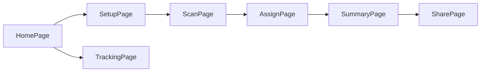

    # Makan Split - Architecture Documentation

> **Last Updated:** 2026-01-19

## Overview

Makan Split은 영수증 기반 비용 분할 앱입니다. 사용자가 영수증을 스캔하면 AI가 항목을 추출하고, 멤버들에게 항목을 할당하여 각자 낼 금액을 계산합니다.

---

## Tech Stack

| Layer | Technology |
|-------|------------|
| Frontend | React 18 + Vite |
| Styling | TailwindCSS |
| Routing | React Router DOM |
| State | React Context API |
| OCR | Gemini API (gemini-1.5-flash) |
| Database | Supabase (PostgreSQL) |
| Deployment | Vercel |

---

## Folder Structure

```
src/
├── App.jsx              # 라우팅 설정
├── main.jsx             # 엔트리 포인트
├── index.css            # 글로벌 스타일
│
├── pages/               # 페이지 컴포넌트
│   ├── HomePage.jsx     # 홈 (새 분할 시작 또는 기존 기록 보기)
│   ├── SetupPage.jsx    # 멤버 추가
│   ├── ScanPage.jsx     # 영수증 스캔 (OCR)
│   ├── AssignPage.jsx   # 항목 → 멤버 할당
│   ├── SummaryPage.jsx  # 각 멤버별 금액 요약
│   ├── SharePage.jsx    # 공유 링크 생성
│   └── TrackingPage.jsx # 결제 추적
│
├── components/ui/       # 재사용 UI 컴포넌트
│   ├── Button.jsx
│   ├── Card.jsx
│   ├── Input.jsx
│   ├── Layout.jsx       # 공통 레이아웃
│   └── Modal.jsx
│
├── context/
│   └── SplitContext.jsx # 전역 상태 관리 (멤버, 항목, 할당)
│
├── services/
│   └── gemini.js        # Gemini OCR 서비스
│
└── lib/
    ├── supabase.js      # Supabase 클라이언트
    └── utils.js         # 유틸리티 함수
```

---

## User Flow



1. **HomePage**: 새 분할 시작 또는 이전 기록 확인
2. **SetupPage**: 함께 식사한 멤버 추가
3. **ScanPage**: 영수증 촬영 → Gemini OCR로 항목 추출
4. **AssignPage**: 각 항목을 누가 먹었는지 할당
5. **SummaryPage**: 각 멤버별 총 금액 확인
6. **SharePage**: WhatsApp/DuitNow 링크 공유
7. **TrackingPage**: 누가 결제했는지 추적

---

## State Management

### SplitContext

`SplitContext.jsx`가 전역 상태를 관리합니다:

| State | Description |
|-------|-------------|
| `members` | 분할에 참여하는 멤버 목록 |
| `items` | OCR로 추출된 영수증 항목 |
| `assignments` | 항목 → 멤버 매핑 |
| `splitId` | 현재 분할 세션 ID (Supabase) |

주요 함수:
- `addMember()` / `removeMember()`
- `addItem()` / `updateItem()` / `removeItem()`
- `assignItem()` / `unassignItem()`
- `saveSplit()` / `loadSplit()`

---

## External Services

### 1. Gemini API (OCR)
- **파일**: `src/services/gemini.js`
- **모델**: `gemini-1.5-flash`
- **기능**: 영수증 이미지 → JSON 항목 배열 추출
- **환경변수**: `VITE_GEMINI_API_KEY`

### 2. Supabase (Database)
- **파일**: `src/lib/supabase.js`
- **환경변수**: `VITE_SUPABASE_URL`, `VITE_SUPABASE_ANON_KEY`
- **테이블**:
  - `splits`: 분할 세션
  - `participants`: 멤버
  - `items`: 영수증 항목
  - `item_assignments`: 항목-멤버 매핑

---

## Environment Variables

`.env.local` 파일에 필요:

```env
VITE_GEMINI_API_KEY=your_gemini_api_key
VITE_SUPABASE_URL=your_supabase_url
VITE_SUPABASE_ANON_KEY=your_supabase_anon_key
```

---

## Running Locally

```bash
npm install
npm run dev
```

---

## Future Considerations

- [ ] 사용자 인증 (Supabase Auth)
- [ ] 다국어 지원 (i18n)
- [ ] PWA 지원 (오프라인 모드)
- [ ] 정산 히스토리 대시보드
